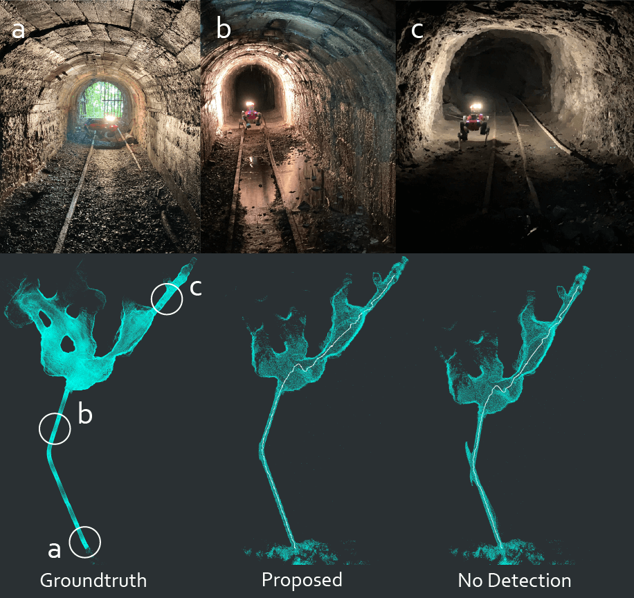

# lidar_loc: Learning-based Localizability Estimation for Robust LiDAR Localization

## Overview

This is the corresponding repository to the paper "Learning-based Localizability Estimation for Robust LiDAR Localization".

**Authors:** [Julian Nubert](https://juliannubert.com/) ([julian.nubert@mavt.ethz.ch](mailto:nubertj@ethz.ch?subject=[GitHub]))
, [Etienne Walther](https://www.linkedin.com/in/etienne-walther/)
, [Shehryar Khattak](https://www.linkedin.com/in/shehryar-khattak/)
, [Marco Hutter](https://rsl.ethz.ch/the-lab/people/person-detail.MTIxOTEx.TGlzdC8yNDQxLC0xNDI1MTk1NzM1.html)

**The work is currently under review. The corresponding code will be published upon publication of the paper.**
From the [Robotics Systems Lab](https://rsl.ethz.ch/) at ETH Zurich, Switzerland.

